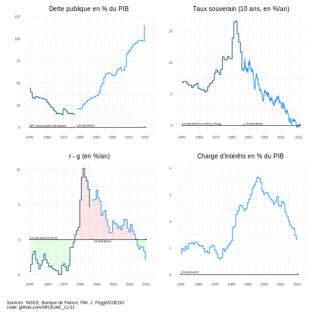

# OFCE Repro année 2021

Reproductibilité des graphiques 2021 sous R

Les codes pour reproduire les graphiques (une partie) publiés sont mis dans ce dépôt. Chaque dossier correspond à une publication pour l'année 2021.

## Alternative Economiques :

### hors série janvier 2021;

*Dette post-covid : l'austérité est-elle nécessaire ?* par Xavier Timbeau

Graphiques : [AE_21-11/dette_fr.r](AE_21-11/dette_fr.r)

### Chronique Altereco décembre 2021 ;

*Nombre de fonctionnaires : la France n'en a pas plus que les autres* par Xavier Timbeau

Graphique : [AE_21-12/COFOG.r](AE_21-12/COFOG.r)

## Repère Europe 2022

### La dette publique en zone euro après le COVID, par Xavier Timbeau

Graphiques 1 à 3 : [g1 g2.r](repere_europe_2022/XT_dette_post_covid/g1_g2.R) ; [g3.r](repere_europe_2022/XT_dette_post_covid/g3.R)

Tableau simulation : le code doit tourner dans dwr pour utiliser debtwatch, il est copié ici. Penser à mettre le wd au bon niveau (may the force be with you) [simulations.r](repere_europe_2022/XT_dette_post_covid/simulations.R)
